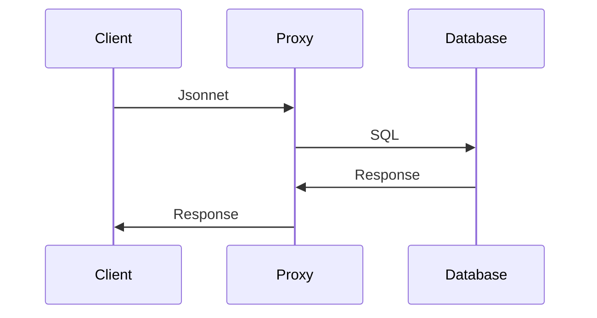
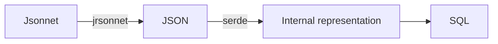
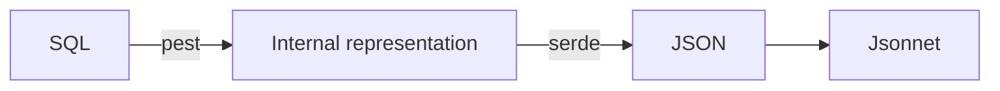

> [!WARNING]  
> Work in progress.

Express SQL queries with a simple [Jsonnet](https://jsonnet.org/) representation, which can be easily templated using the [Jsonnet configuration language](https://jsonnet.org/learning/tutorial.html).

For example, the following Jsonnet input

```jsonnet
select: {
  fields: ['bwv', u.count()],
  from: 'cantatas',
} + { groupBy: ['year'], limit: 10 }
```

produces the following SQL query

```sql
SELECT bwv, count(*) AS c
FROM cantatas
GROUP BY year
LIMIT 10;
```

This becomes particularly useful when working with sets of complex queries, which can be created and maintained in a composable way, like source code, benefiting from the Jsonnet ecosystem (language server, formatter, linter, editor integrations).

In-browser playground/demo with [WebAssembly](https://en.wikipedia.org/wiki/WebAssembly): see https://cpg314.github.io/sqlsonnet/

### Features

- Command-line interface to convert sqlsonnet to SQL, and vice-versa.
  - Good error reporting thanks to [`miette`](https://docs.rs/miette/latest/miette/index.html).
- Compatible with existing Jsonnet tools (formatter, LSP).
- Proxy server for Clickhouse (HTTP interface), supporting incoming sqlsonnet or SQL.
  - Shared library and prelude.
  - Response caching (similarly to [`chproxy`](https://www.chproxy.org/)).
  - Interactive playground.
- Bindings for [WebAssembly](https://en.wikipedia.org/wiki/WebAssembly).
- In-browser [interactive playground](https://cpg314.github.io/sqlsonnet/), using the WebAssembly bindings.

## Installation

The [releases page](https://github.com/cpg314/sqlsonnet/releases) contains binaries (simple `tar` archive, Debian/Ubuntu `.deb` package, ArchLinux `.pkg`).

A [Docker image](https://github.com/cpg314/sqlsonnet/pkgs/container/sqlsonnet) with `sqlsonnet` and `sqlsonnet_clickhouse_proxy` is also available at `ghcr.io/cpg314/sqlsonnet:0.1.1`.

Alternatively, see below for building from source.

### Recommended tools

- The [jsonnet language server](https://github.com/grafana/jsonnet-language-server).
- The [jsonnetfmt formatter](https://github.com/google/go-jsonnet/tree/master).
- The jsonnet integration for your favourite editor.

See also the official [Jsonnet Tools page](https://jsonnet.org/learning/tools.html).

## Command line interface

The `sqlsonnet` command line interface converts Jsonnet statements to (and to a lesser extent from) SQL.

```
Usage: sqlsonnet [OPTIONS] <INPUT>

Arguments:
  <INPUT>  Input file (path or - for stdin)

Options:
      --theme <THEME>
          Color theme for syntax highlighting [env: SQLSONNET_THEME=Nord] [possible values: 1337, Coldark-Cold, Coldark-Dark, DarkNeon, Dracula, GitHub, "Monokai Extended", "Monokai Extended Bright", "Monokai Extended Light", "Monokai Extended Origin", Nord, OneHalfDark, OneHalfLight, "Solarized (dark)", "Solarized (light)", "Sublime Snazzy", TwoDark, "Visual Studio Dark+", ansi, base16, base16-256, gruvbox-dark, gruvbox-light, zenburn]
  -c, --compact
          Compact SQL representation
  -f, --from-sql
          Convert an SQL file into Jsonnet
      --diff
          With --from-sql: Convert back to SQL and print the differences with the original, if any
      --display-format <DISPLAY_FORMAT>
          [possible values: sql, jsonnet, json]
      --clickhouse-url <CLICKHOUSE_URL>
          Clickhouse HTTP URL, to execute queries [env: SQLSONNET_CLICKHOUSE=]
  -w, --watch
          Watch for file changes
  -J, --jpath <JPATH>
          Library path [env: JSONNET_PATH=]
  -e, --execute
          Send query to Clickhouse proxy (--proxy-url) for execution
  -h, --help
          Print help
  -V, --version
          Print version
```

#### Jsonnet to SQL

```console
$ sqlsonnet test.jsonnet
$ # stdin input is also supported
$ cat test.jsonnet | sqlsonnet -
$ # Piping into clickhouse client
$ sqlsonnet test.jsonnet | clickhouse client -f PrettyMonoBlock --multiquery --host ... --user ...
```

The input should represent a list of queries, e.g.

```jsonnet
[ { select: { ... } } ]
```

The [embedded utility functions](sqlsonnet/sqlsonnet.libsonnet) are automatically imported as

```jsonnet
local u = import "sqlsonnet.libsonnet";
```

#### SQL to Jsonnet (`from-sql`)

```console
$ sqlsonnet --from-sql test.sql
$ cat test.sql | sqlsonnet --from-sql -
```

This mode is useful to discover the sqlsonnet syntax from SQL queries.

The parser is far from perfect. Expressions are parsed as long as subqueries are encountered; then they are simply represented as strings. The results do not use the [embedded utility functions](sqlsonnet/sqlsonnet.libsonnet), which can significantly simplify expressions.

## As a Rust library

```rust
use sqlsonnet::{Query, sqlsonnet_query, jsonnet::Options};

// This performs compile-time syntax checking
let query: Query = sqlsonnet_query!({ select: { fields: ["name", "age"], from: "contacts" } }).unwrap();
// Convert to SQL
assert_eq!(query.to_sql(true), "SELECT name, age FROM contacts");
```

## Syntax

```jsonnet
[
  {
    select: {
      // List of expressions
      fields: [
        // Primitive types
        1,
        1.0,
        true,
        '"string"',
        // Column reference
        'col',
        // Aliased expression
        u.as('col', 'alias'),
        // Operator, equivalent to [1, "+", 2]
        u.op('+', [1, 2]),
        // Equivalent to u.op("=", [1, 2])
        u.eq(1, 2),
        // Function, equivalent to {fn: "count", params: ["*"]}
        u.fn('count', ['*']),
      ],
      // From expression (optional)
      from: 'a',
      // List of expressions (optional)
      groupBy: [],
      // List of joins (optional)
      joins: [
        // From expression and ON (list of boolean expressions)
        { from: 'b', on: ['f1=f2'] },
        // From expression and USING (list of column identifiers)
        { from: 'c', using: ['f'] },
        // An empty `on` or `using` parameter results in a CROSS JOIN
        { from: 'd', using: [] },
        // Other types of joints
        { from: 'e', using: ['f'], kind: 'left-outer' },
      ],
      // Expression (optional). Use u.and, u.or to combine.
      having: true,
      // Expression (optional). Use u.and, u.or to combine.
      where: true,
      // List of identifiers or { expr: identifier, order: "desc" } or { expr: identifier, order: "asc" }
      orderBy: ['col1', { expr: 'col2', order: 'desc' }, { expr: 'col3', order: 'asc' }],
      // Integer (optional)
      limit: 100,
      // List of expressions (optional)
      settings: ['join_algorithm="parallel_hash"'],
    },
  },
]
```

A `From` expression can be either:

```jsonnet
// Table name
from: 'a',
// Aliased table name
from: { table: 'a', as: 'b' },
// Subquery with optional alias
from: { fields: ['*'], from: 'b', as: 'c' },
```

Expressions (used in `fields`, `groupBy`, `on`, `having`, `orderBy`) are defined recursively with primitive types, column references, aliases, operators, and functions.

### Combining expressions

Use the `+:` operator to add fields or JOINs to an existing query; using the `+` operator would overwrite the existing values.

```jsonnet
u.select(
  {
    fields: [0],
    from: 'a',
    joins: [{ from: 'b', using: ['col1'] }],
  } + {
    fields+: [1],
    joins+: [{ from: 'c', using: ['col2'] }],
  }
),
```

Similarly the `u.where_and` (resp. `u.having_and`) utilities to add `WHERE` (resp `HAVING`) conditions. These essentially change the `where` field to `where: u.and([super.where, expr])`.

```jsonnet
u.select(
  {
    fields: [0],
    from: 'a',
    where: u.eq(1, 1),
  } + u.where_and([u.ge(2, 1)]),
),
```

## Database proxies

The database proxies convert Jsonnet requests into SQL, before sending them to the database server and returning the response.



They also support:

- Caching responses to previous requests.
- Custom import paths.
- Prepending all queries with a prelude (e.g. to make available libraries in the import path).
- Serving an interactive playground where users can enter Jsonnet, and see the generated SQL as well as the database response.

### `sqlsonnet_clickhouse_proxy`

> [!WARNING]  
> The current implementation assumes a fully trusted environment.

```text
Reverse proxies a Clickhouse HTTP server, transforming Jsonnet or JSON queries into SQL

Usage: sqlsonnet_clickhouse_proxy [OPTIONS] --url <URL> --username <USERNAME> --port <PORT>

Options:
      --url <URL>            [env: CLICKHOUSE_URL=]
      --username <USERNAME>  Clickhouse username [env: CLICKHOUSE_USERNAME=]
      --password <PASSWORD>  [env: CLICKHOUSE_PASSWORD=]
      --cache <CACHE>
      --library <LIBRARY>    Folder with Jsonnet library files
      --shares <SHARES>      Folder with shared snippets
      --prelude <PRELUDE>    Prepended to all requests
      --port <PORT>
  -h, --help                 Print help (see more with '--help')
  -V, --version              Print version
```

Features:

- Caching
- Library shared across clients
- Prelude
- End-to-end compression: when the `Accept-Encoding` header is set by the client, the server directly forwards the encoded data.

## Implementation details

### Jsonnet to SQL

Input Jsonnet is interpreted as JSON using the [jrsonnet crate](https://github.com/CertainLach/jrsonnet), and then mapped via [serde](https://serde.rs/) into an internal representation of queries, which can finally be pretty-printed as SQL.



### SQL to Jsonnet

Input SQL is parsed into the internal representation using the [pest PEG parser](https://pest.rs/), which can then be converted to JSON using serde, and finally printed as Jsonnet.



## Development

Install [cargo make](https://github.com/sagiegurari/cargo-make).

### Building from source

```
$ cargo make packages
$ # To also build a docker image:
$ cargo make docker
$ # Build wasm bindings
$ cargo make wasm
$ # Build playground
$ cargo make playground-wasm
```

### Running checks and tests

Install [checkalot](https://github.com/cpg314/checkalot) and run:

```
$ cargo checkalot
```

This runs in particular

```
$ cargo make docker-compose
$ cargo nextest run --workspace -r
```

## TODO

- Proxy:
  - Cache control: expire cache entries, etc.
  - Support Postgres
- Prevent representation of invalid SQL.
- Support more query types than `SELECT`.
